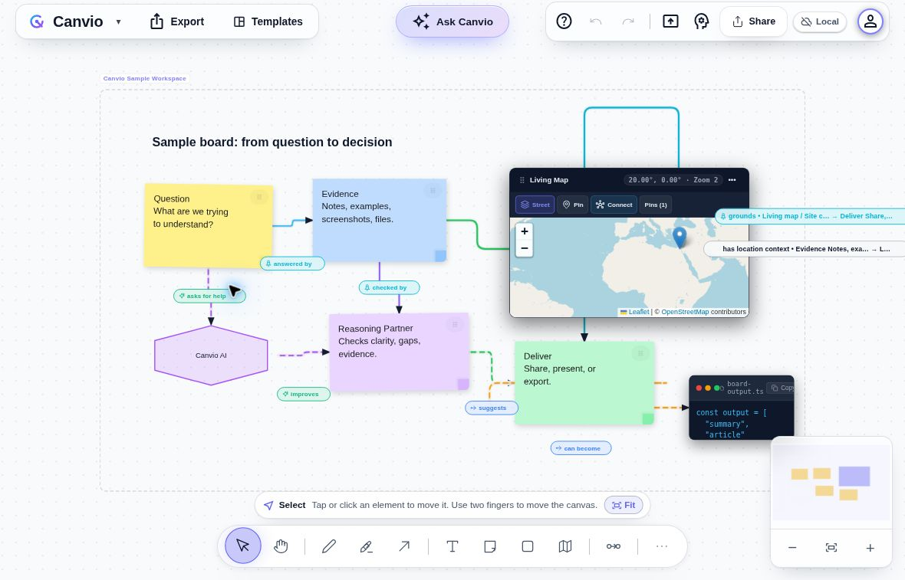
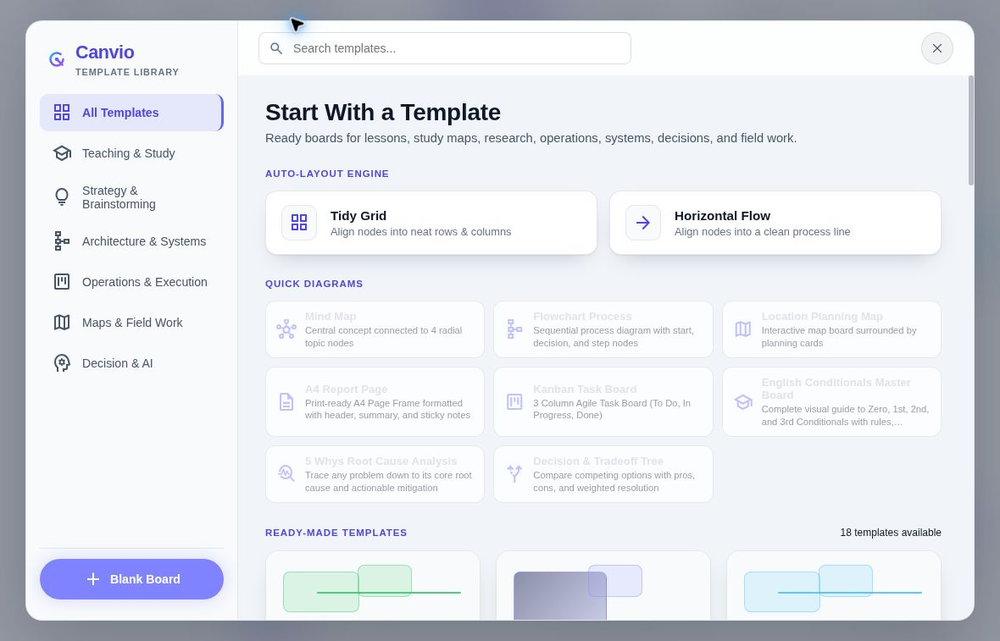

# Canvio

### A connected whiteboard for learning, planning, and research

[Open Canvio](https://canvio.space/) · [Product updates](https://canvio.space/updates)

**My role:** Founder, product designer, and developer.

Canvio brings notes, evidence, diagrams, and maps into a shared visual workspace. Labeled relationships help explain how ideas connect, while board-aware AI supports work built from that context.

*The built-in sample board, captured from the public product on October 5, 2026. All content shown is demonstration material.*

## What you can explore

- **Connected thinking:** sticky notes, text, shapes, drawing, code blocks, and labeled relations on a visual canvas.
- **Maps in context:** a Living Map with pins and connections to board content, for tasks where location matters.
- **Starting points:** templates for study maps, lesson planning, research, product discovery, system architecture, and field operations.
- **Board-aware AI:** the public product notes describe creating editable boards, studying, summarizing, drafting articles, and organizing content from board context.
- **Sharing and delivery:** presentation and sharing controls, with PNG, PDF, and JSON backup options in the export menu.

*The template library as displayed in the public sample workspace.*

## A simple first walkthrough

1. Open [Canvio](https://canvio.space/) and choose **Explore a sample**.
2. Follow the sample's question, evidence, reasoning, and delivery nodes. Read the labels on their connections.
3. Inspect the Living Map to see how location can sit beside notes and decisions.
4. Open **Templates** to browse starting points, or inspect **Export** for available output formats.

The public sample opened without a sign-in during this review. Feature availability and external-service requirements may vary; check the live product before relying on a workflow.

## Product approach

Canvio supports a straightforward loop: gather useful material, make it visible, connect its meaning, and share the result. Maps add location context when needed, and the same canvas can support a study topic, a planning workshop, or a research question.

The [public updates archive](https://canvio.space/updates) documents the thinking behind relations, map-based work, board-aware AI, and interaction design.

## About this showcase

This page presents the public product and sample UI. Canvio's application source is maintained privately and is not included in this profile repository.

Screenshots and feature descriptions were reviewed on October 5, 2026. The sample board, template library, and export menu were inspected; AI generation, multi-user collaboration, and export file creation were not end-to-end tested for this showcase.
